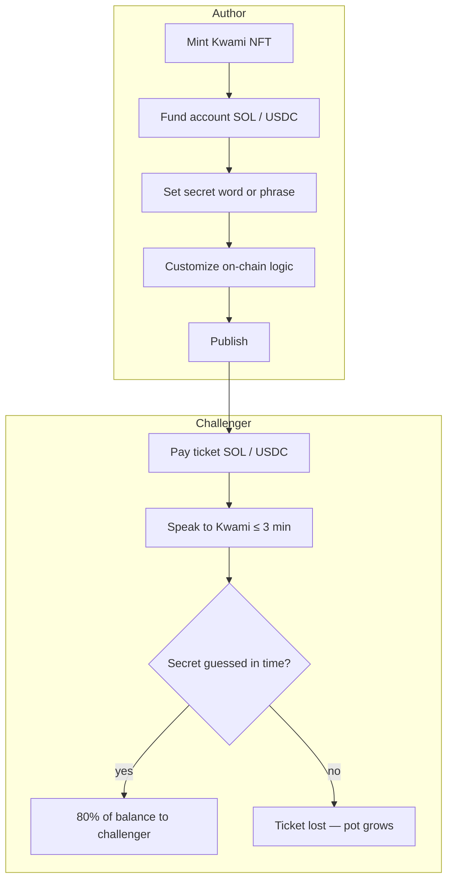

# Kwami

[](./LICENSE)
[](https://www.npmjs.com/package/kwami)
[](https://github.com/kwami-labs/kwami/actions/workflows/ci.yml)
[](./.nvmrc)
[](https://pnpm.io/)

**Kwami v3** is a Solana NFT collection and fully on-chain web3 app. Connect with [Phantom](https://phantom.app/), fund via [MoonPay](https://www.moonpay.com/), mint a Kwami, publish it, and let others challenge it in a timed voice duel for a share of its account balance.

> Mint · fund · publish · challenge · win (or grow the pot)

---

## Table of contents

- [Overview](#overview)
- [Features](#features)
- [How it works](#how-it-works)
- [Wallet & onboarding](#wallet--onboarding)
- [Getting started](#getting-started)
- [Scripts](#scripts)
- [Project structure](#project-structure)
- [Documentation](#documentation)
- [Contributing](#contributing)
- [Security](#security)
- [Releases](#releases)
- [License](#license)

---

## Overview

Kwami combines a **Solana NFT**, a **funded on-chain account**, and a **voice AI companion**. Authors mint and publish Kwamis; challengers pay in **SOL** or **USDC** for a **3-minute** voice session to discover the secret word or phrase.

| Outcome                            | Result                                                       |
| ---------------------------------- | ------------------------------------------------------------ |
| Challenger says the secret in time | Receives **80%** of the Kwami’s account balance (SOL + USDC) |
| Time runs out or secret is wrong   | Ticket is lost; the author’s Kwami account keeps growing     |

Kwamis are **immutable** metadata but **transferable** assets — they can be bought and sold. The 3D model can be embedded in third-party apps. Minted owners unlock an **AI program builder** that generates Solana sub-programs for complex financial games before publish.

---

## Features

- **Solana NFT collection** — mint, own, transfer, and trade Kwamis
- **Phantom wallet** — connect and sign on Solana
- **MoonPay on-ramp** — fiat → SOL/USDC without leaving the app
- **Paid voice challenges** — SOL or USDC tickets, 3-minute sessions
- **Account economics** — 80% reward on win; pot grows on miss
- **Kwami death** — dies after losing **99%** of account value, or when balance falls under **~$1 USD**
- **Immutable + transferable** — metadata locked; ownership can change on secondary markets
- **Embeddable 3D model** — integrate the Kwami avatar in any third-party app
- **AI program builder** — generate Solana sub-programs and smart-contract logic for custom financial games before publishing

---

## How it works



| Concept                | Detail                                                                                              |
| ---------------------- | --------------------------------------------------------------------------------------------------- |
| **Mint & publish**     | Create a Kwami NFT, fund its account, set a secret, optionally customize Solana logic, then publish |
| **Paid interaction**   | Challengers pay in SOL or USDC for a voice session                                                  |
| **Voice challenge**    | 3-minute window to discover the secret by speaking to the Kwami                                     |
| **Reward split**       | Correct guess → 80% of balance to the challenger; miss → author keeps the ticket                    |
| **Death**              | Loses 99% of account value, or balance under ~$1 USD                                                |
| **Ownership**          | Immutable metadata; transferable NFT (buy / sell)                                                   |
| **3D model**           | Embeddable in third-party applications                                                              |
| **AI program builder** | Generate Solana sub-programs for complex games before publish                                       |

---

## Wallet & onboarding

| Integration                         | Role                                   |
| ----------------------------------- | -------------------------------------- |
| [Phantom](https://phantom.app/)     | Wallet connect and Solana transactions |
| [MoonPay](https://www.moonpay.com/) | Fiat on-ramp for SOL / USDC            |

---

## Getting started

### Prerequisites

| Tool                           | Requirement                                                                                 |
| ------------------------------ | ------------------------------------------------------------------------------------------- |
| [Node.js](https://nodejs.org/) | Version in [`.nvmrc`](./.nvmrc) (`>= 22.14`) — `nvm use`                                    |
| [pnpm](https://pnpm.io/)       | `>= 10` — `corepack enable` picks up `packageManager` from [`package.json`](./package.json) |

`pnpm-lock.yaml` is the lockfile of record. CI installs with `--frozen-lockfile`; an `npm install` here produces a lockfile CI will reject.

### Install

```bash
git clone https://github.com/kwami-labs/kwami.git
cd kwami
nvm use
corepack enable
pnpm install    # also installs husky hooks
```

### Build & verify

```bash
pnpm build
pnpm lint && pnpm typecheck && pnpm test:run
```

### Consume the package

```bash
pnpm add kwami          # latest stable (main)
pnpm add kwami@rc       # release candidate (stg)
pnpm add kwami@dev      # prerelease (dev)
```

`three` is a peer dependency when embedding the 3D model:

```bash
pnpm add three
```

---

## Scripts

```bash
# Build
pnpm build              # bundle + type declarations → dist/
pnpm dev                # rebuild on change
pnpm clean              # remove dist/, coverage/, and test output

# Quality
pnpm lint
pnpm lint:fix
pnpm format
pnpm format:check
pnpm typecheck
pnpm audit:ci

# Tests — see docs/testing.md
pnpm test               # unit
pnpm test:watch
pnpm test:coverage      # unit + coverage ratchet (CI)
pnpm test:integration
pnpm test:e2e           # built bundle in a real browser (WebGL)
pnpm test:all

# Releases — see docs/releases.md
pnpm release:dry-run    # print next version; change nothing
```

---

## Project structure

```text
kwami/
├── src/                  # Library source
│   ├── agent/            # Voice pipeline + LiveKit adapter
│   ├── avatar/           # 3D renderers
│   ├── memory/           # Memory adapters (client stub)
│   ├── soul/             # Personality
│   ├── skills/           # Native behaviors
│   ├── tools/            # Tool registry (MCP)
│   ├── types/            # TypeScript definitions
│   └── Kwami.ts          # Public entry surface
├── tests/
│   ├── unit/
│   ├── integration/
│   └── e2e/
├── scripts/
│   ├── ci/               # Pipeline gates
│   └── release/          # Baseline tag, back-merge
├── docs/                 # Architecture, API, security, CI, …
├── .github/              # Workflows, issue/PR templates, CODEOWNERS
├── CHANGELOG.md          # Generated by semantic-release
├── CODE_OF_CONDUCT.md
├── CONTRIBUTING.md
├── GOVERNANCE.md
├── SECURITY.md
├── SUPPORT.md
├── LICENSE               # Apache-2.0
└── package.json
```

---

## Documentation

Full index: **[docs/README.md](./docs/README.md)**.

| Document                                             | Description                                      |
| ---------------------------------------------------- | ------------------------------------------------ |
| [docs/getting-started.md](./docs/getting-started.md) | Install, mount, connect, dispose                 |
| [docs/architecture.md](./docs/architecture.md)       | Modules, mermaid diagrams, connect & voice flows |
| [docs/api.md](./docs/api.md)                         | Public surface (`Kwami`, config, exports)        |
| [docs/security.md](./docs/security.md)               | Agent identity, keys, tool RPC, supply chain     |
| [docs/testing.md](./docs/testing.md)                 | Unit / integration / e2e layers                  |
| [docs/ci-cd.md](./docs/ci-cd.md)                     | Pipeline, promotion gate, rulesets               |
| [docs/releases.md](./docs/releases.md)               | Channels, version bumps, troubleshooting         |
| [docs/changelog.md](./docs/changelog.md)             | How to read the generated history                |
| [CONTRIBUTING.md](./CONTRIBUTING.md)                 | Setup, branches, commits, PR checklist           |
| [CODE_OF_CONDUCT.md](./CODE_OF_CONDUCT.md)           | Contributor Covenant                             |
| [GOVERNANCE.md](./GOVERNANCE.md)                     | Maintainers and how releases land                |
| [SECURITY.md](./SECURITY.md)                         | Supported versions & vulnerability reporting     |
| [SUPPORT.md](./SUPPORT.md)                           | Where to ask for help                            |
| [CHANGELOG.md](./CHANGELOG.md)                       | Released changes (generated — do not edit)       |
| [LICENSE](./LICENSE)                                 | Apache License 2.0 (full text)                   |

---

## Contributing

Contributions are welcome. Please read **[CONTRIBUTING.md](./CONTRIBUTING.md)** before opening a PR.

**Branch promotion** (enforced in CI):

```text
feature/* ──► dev ──► stg ──► main
```

- Branch off `dev`; open PRs against `dev`
- Use [Conventional Commits](https://www.conventionalcommits.org/) — versions, tags, changelog, and npm publishes are derived from them
- Feature PRs are **squash-merged**; the PR title becomes the release subject
- Before push: `pnpm lint && pnpm typecheck && pnpm test:unit && pnpm test:integration`

Issue tracker: [github.com/kwami-labs/kwami/issues](https://github.com/kwami-labs/kwami/issues)

---

## Security

**Do not open public issues for vulnerabilities.**

Report privately via [GitHub Security Advisories](https://github.com/kwami-labs/kwami/security/advisories/new). Policy: **[SECURITY.md](./SECURITY.md)**. Deploying the library (agent identity, provider keys, tool handlers): **[docs/security.md](./docs/security.md)**.

---

## Releases

Releases are automated with [semantic-release](https://semantic-release.gitbook.io/). Do not hand-edit `CHANGELOG.md` or the `version` field.

| Branch | npm tag  | Channel           |
| ------ | -------- | ----------------- |
| `main` | `latest` | Stable            |
| `stg`  | `rc`     | Release candidate |
| `dev`  | `dev`    | Prerelease        |

Details: [docs/releases.md](./docs/releases.md) · History: [CHANGELOG.md](./CHANGELOG.md)

---

## License

Copyright © 2025 [Alex Colls Outumuro](https://github.com/alexcolls)

Licensed under the **Apache License, Version 2.0**. See the [LICENSE](./LICENSE) file for the full text.

```text
Licensed under the Apache License, Version 2.0 (the "License");
you may not use this file except in compliance with the License.
You may obtain a copy of the License at

    http://www.apache.org/licenses/LICENSE-2.0

Unless required by applicable law or agreed to in writing, software
distributed under the License is distributed on an "AS IS" BASIS,
WITHOUT WARRANTIES OR CONDITIONS OF ANY KIND, either express or implied.
See the License for the specific language governing permissions and
limitations under the License.
```
