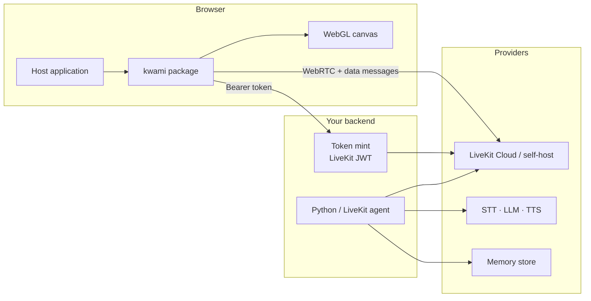
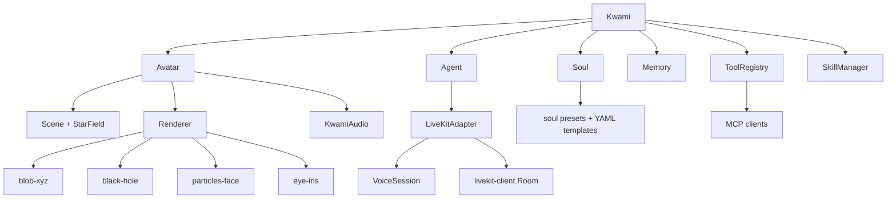
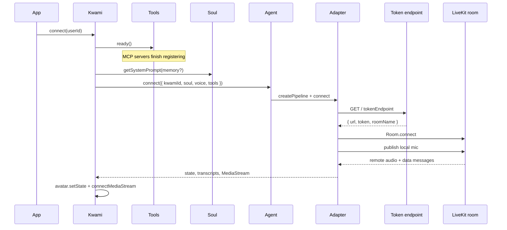
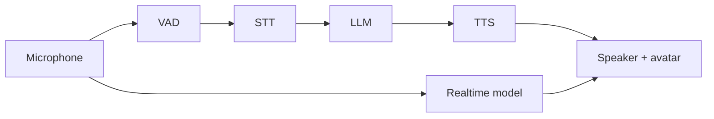
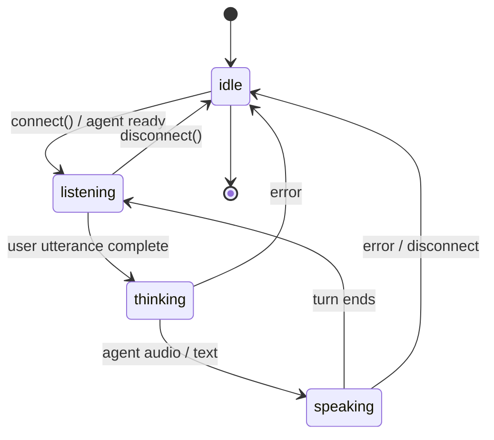
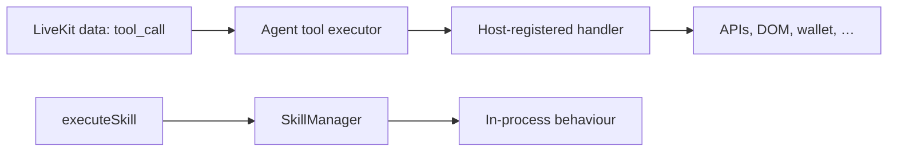
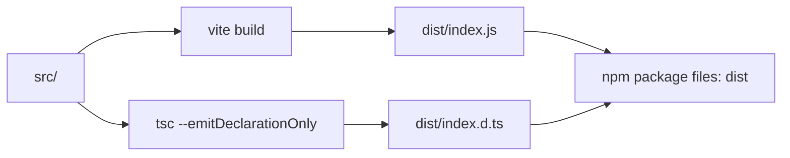

# Architecture

This repository publishes **`kwami`**: a TypeScript browser library. A host page mounts a
`Kwami` on a canvas; the instance owns a WebGL avatar, a soul (prompt + traits), a tool
registry, and a LiveKit adapter that talks to a **backend agent**. The LLM, STT, TTS, and
long-term memory run on that backend — not in the browser.

The library never holds provider API keys in a safe deployment. It sends a **dispatch payload**
(soul, voice descriptor, tool schemas) when the room connects; the agent does the inference.

---

## Modules

`Kwami` is a façade. Construction wires six subsystems and registers the instance in a process
map (`Kwami.getInstance(id)`). Nothing is a singleton except that registry — dispose what you
create.

| Module           | Path                      | Responsibility                                                             |
| ---------------- | ------------------------- | -------------------------------------------------------------------------- |
| **Kwami**        | `src/Kwami.ts`            | Lifecycle, `connect` / `dispose`, config sync, event wiring                |
| **Avatar**       | `src/avatar/`             | Scene, one active renderer, audio-reactive motion, GPU context recovery    |
| **Agent**        | `src/agent/`              | Adapter selection, voice config merge, tool executors, backend sync        |
| **Soul**         | `src/soul/`               | Identity, system prompt, emotional traits, 20 presets                      |
| **Memory**       | `src/memory/`             | Frontend stub — recall lives on the backend                                |
| **ToolRegistry** | `src/tools/`              | Custom tools + MCP; schemas go on the wire, handlers stay in the page      |
| **SkillManager** | `src/skills/`             | In-process behaviours (animations, workflows), not remote APIs             |
| **api-client**   | `src/utils/api-client.ts` | HTTP helpers for a Kwami memory / graph API                                |
| **logger**       | `src/utils/logger.ts`     | Level filter; masks `apiKey` / `token` / `secret` / `authorization` fields |

Public exports are assembled in [`src/index.ts`](../src/index.ts). Adding one is a `feat`;
removing or renaming one is a breaking change.

---

## Runtime: connect

`connect(userId)` is idempotent for an in-flight call. It waits for MCP tools, optionally
initializes memory, builds the system prompt, then asks the agent to join a room.

`getFullConfig()` is the snapshot the host can inspect. The connect path currently keys the
backend session with `userId` (so memory can persist across page loads), not the random
instance id.

Live updates (`updateVoice`, `updateSoul`, `registerTool`) patch local state and, if connected,
`syncConfigToBackend` so the running agent does not need a reconnect.

---

## Voice pipeline

The browser does **not** run STT/LLM/TTS. `VoicePipelineConfig` is a descriptor the adapter
serializes for the agent. Two shapes:

| Type          | Pieces                     | Typical use     |
| ------------- | -------------------------- | --------------- |
| `stt-llm-tts` | VAD → STT → LLM → TTS      | Swap each stage |
| `realtime`    | One speech-to-speech model | Lowest latency  |

Providers and models live in `src/agent/voice/` (`catalog.ts`, `types.ts`). The catalogue is
what the host UI enumerates; the agent backend must actually support the chosen pair.

---

## State machine

Avatar and agent share a four-state conversation machine. The adapter may also report
`initializing`, which `Kwami` maps to `idle`.

Agent audio is piped into the avatar (`connectMediaStream`) so skins and the eye iris can react
to the voice, not just to the enum.

---

## Avatar

`Avatar` owns a `Scene` (camera, lights, optional `StarField`, OrbitControls) and **one**
active renderer. Renderers keep their own draw loop; Avatar ticks the scene (stars, damping)
and recovers from `webglcontextlost` by disposing the renderer and building it again.

| Renderer         | Idea                                 |
| ---------------- | ------------------------------------ |
| `blob-xyz`       | Deforming sphere, many GLSL skins    |
| `black-hole`     | Disc + lensing                       |
| `particles-face` | Particle face, mouth / breath motion |
| `eye-iris`       | Iris shader, pointer-follow pupil    |

`three` is a **peer** dependency. The host bundles it; the library must not pin a narrower
range than `peerDependencies`.

---

## Soul

`Soul` is pure data → prompt. `getSystemPrompt()` concatenates system text, personality,
traits, style, length, tone, and weighted emotional traits. Twenty presets
(`src/soul/presets.ts`) plus YAML templates under `src/soul/templates/` cover the same
catalogue (friendly, professional, sarcastic, …).

Traits are prompt-shaping only. They do not grant tools or change renderer code.

---

## Tools vs skills

- **Tools** — remote capabilities. Schemas (JSON Schema, handlers stripped) travel to the
  agent. Execution happens in the **browser** when a trusted participant sends `tool_call`.
  That is why [agent identity](./security.md#pin-the-agent-identity) is not optional in
  production.
- **Skills** — local behaviours. Names are listed in the dispatch payload; `executeSkill`
  runs in-process. Built-in skills are still a hook (`registerBuiltInSkills`).

MCP servers configured on `ToolRegistry` connect during `ready()`, which `connect()` awaits
so their tools are in the first dispatch.

---

## Memory and the HTTP API

`Memory` on the client is a stub (`addMessage` / `search` no-op). Conversation memory is
expected to live behind the agent. Separately, [`src/utils/api-client.ts`](../src/utils/api-client.ts)
is a fetch wrapper for a Kwami backend:

- graph: nodes, edges, communities, duplicates, merge, reorganize
- facts and ratings
- custom instructions
- ingest

Calls take `apiBaseUrl` + optional `Authorization: Bearer`. The library does not persist that
token.

---

## Lifecycle and leaks

`kwamiRegistry` holds a **strong** reference to every constructed instance. An unmounted
component that skips `dispose()` keeps the WebGL context, the LiveKit room, and the mic track
for the life of the page.

`dispose()` runs each teardown even if an earlier step throws, then removes the registry
entry. Failures surface as `AggregateError`.

Instance ids are 8 characters of `[a-z0-9]` from `crypto.getRandomValues` (unbiased). They
key the registry; they are not capabilities on their own, but a guessable id plus
`getInstance` is a same-page cross-talk bug — hence CSPRNG.

---

## Build and publish

`package.json` `"exports"` expose only `.` and `./package.json`. E2E tests consume the built
`dist/` the way a downstream bundler would — see [testing](./testing.md).

---

## Related

- [Security model](./security.md) — trust boundaries, identity, keys
- [API reference](./api.md) — public types and methods
- [CI/CD](./ci-cd.md) — how a change becomes a version
