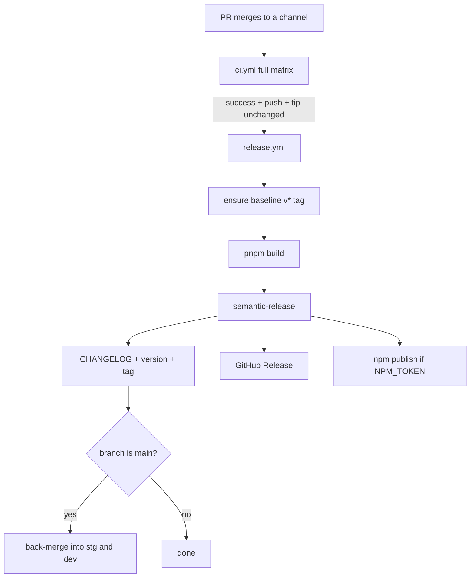

# Releases

Every version, tag, `CHANGELOG.md` entry, GitHub Release and npm publish is derived from the
commit history by [semantic-release](https://semantic-release.gitbook.io/). Nothing is bumped by
hand — the `version` field and `CHANGELOG.md` are outputs, not inputs.

- Config: [`.releaserc.cjs`](../.releaserc.cjs)
- Workflow: [`.github/workflows/release.yml`](../.github/workflows/release.yml)
- Branch model: [`docs/ci-cd.md`](./ci-cd.md)

## Channels

| Branch | Version shape                  | npm dist-tag | GitHub Release |
| ------ | ------------------------------ | ------------ | -------------- |
| `dev`  | `2.2.0-dev.1`, `2.2.0-dev.2` … | `dev`        | Pre-release    |
| `stg`  | `2.2.0-rc.1`, `2.2.0-rc.2` …   | `rc`         | Pre-release    |
| `main` | `2.2.0`                        | `latest`     | Release        |

```bash
npm install kwami          # latest stable, from main
npm install kwami@rc       # the current release candidate, from stg
npm install kwami@dev      # the tip of dev
```

The prerelease counter resets when the base version changes: once `main` cuts `2.2.0`, the next
`dev` release is `2.3.0-dev.1`, not `2.2.0-dev.9`.

## What a commit does

The subject type decides the bump. Kwami is past 1.0, so the standard rules apply.

| Commit                                      | Bump      | Appears in the changelog |
| ------------------------------------------- | --------- | ------------------------ |
| `feat: …`                                   | minor     | **Features**             |
| `fix: …`                                    | patch     | **Bug Fixes**            |
| `perf: …`                                   | patch     | **Performance**          |
| `refactor: …`                               | patch     | **Refactoring**          |
| `revert: …`                                 | patch     | **Reverts**              |
| `build(deps): …`                            | patch     | **Build & Dependencies** |
| `docs:`, `test:`, `ci:`, `chore:`, `style:` | none      | hidden                   |
| any type with a `BREAKING CHANGE:` footer   | **major** | **BREAKING CHANGES**     |

`build(deps)` releases because a shipped dependency bump reaches consumers; `chore(deps-dev)`
does not, because a devDependency does not. Dependabot is configured to use exactly those two
prefixes ([`dependabot.yml`](../.github/dependabot.yml)).

A breaking change needs the footer, not just a `!`:

```text
feat(agent)!: replace the pipeline config shape

BREAKING CHANGE: `agent.voice.pipeline` is now `agent.voice.type`. Replace
`{ pipeline: 'stt-llm-tts' }` with `{ type: 'stt-llm-tts' }`.
```

## The pipeline



1. A PR lands on a channel. `ci` runs the full matrix on the push.
2. `release.yml` fires on `workflow_run: [ci] completed` — only for a **success** on a **push**,
   so no version is ever cut from a red commit.
3. It refuses to run if the branch tip has drifted ahead of the commit `ci` tested; that later
   push has its own run behind it and will release instead.
4. `pnpm release:baseline` tags `v<current version>` if no `v*` tag exists yet, so the first run
   bumps _over_ the version already on npm instead of restarting at 1.0.0.
5. `pnpm build` produces `dist/` — `files` points at it and it is not committed.
6. semantic-release analyses the commits, works out the next version, regenerates
   `CHANGELOG.md`, bumps `package.json`, publishes to npm, pushes the release commit and tag,
   and cuts the GitHub Release.
7. On `main` only, [`sync-branches.mjs`](../scripts/release/sync-branches.mjs) back-merges `main`
   into `stg` and `dev`.

### Why the back-merge

A release commit only lands on the branch that produced it. Once `main` publishes `2.2.0`, `stg`
and `dev` still carry the `-rc` / `-dev` baseline: they would keep cutting prereleases of a
version that already shipped, and the next promote PR would conflict on exactly the two files
semantic-release wrote. The back-merge resolves those two — and only those two — the only way
they can be:

| File           | Resolution                                                                                          |
| -------------- | --------------------------------------------------------------------------------------------------- |
| `package.json` | keep the branch's own contents, adopt `main`'s released version                                     |
| `CHANGELOG.md` | take `main`'s copy wholesale — its stable section already covers every prerelease entry it replaces |

Anything else conflicting is a real conflict: the script aborts the merge and asks for a human.

### npm publishing

Publishing is conditional on the `NPM_TOKEN` secret. Without it the run still versions, tags,
writes the changelog and cuts the GitHub Release — a fork, or a repo that has not been given a
token yet, gets the whole pipeline minus the publish rather than a red build.

Publishes carry [npm provenance](https://docs.npmjs.com/generating-provenance-statements): the
`id-token: write` permission in `release.yml` lets npm attest the tarball to that workflow run.

## First run

The repository has published `2.1.0` to npm without semantic-release. The first automated
release therefore needs a baseline tag so it does not restart the version line:

```bash
git checkout main && git pull
pnpm release:baseline    # tags v2.1.0 at the merge-base and pushes it
```

`release.yml` runs this itself on every release, so it also happens automatically — doing it by
hand first just makes the first `--dry-run` honest.

## Running it locally

```bash
pnpm release:dry-run     # analyse commits, print the next version, change nothing
```

`--no-ci` is already in the script, so it works off a CI runner. It never publishes, tags or
pushes. Set `GITHUB_TOKEN` if you want the GitHub plugin's checks to pass too.

## Troubleshooting

**"There are no relevant changes, so no new version is released."** Every commit since the last
tag on this channel is a non-releasing type (`docs`, `chore`, `ci`, `test`, `style`). Expected.

**The version jumped to 1.0.0.** No `v*` tag was reachable — the baseline tag never made it to
`origin`. Run `pnpm release:baseline` and check `git ls-remote --tags origin`.

**The release commit re-triggered CI.** It should not: `GITHUB_TOKEN` pushes do not start
workflows. If something outside Actions is watching, it should honour the `[skip actions]`
marker in the message.

**A promote PR conflicts on `CHANGELOG.md` / `package.json`.** The back-merge did not run or
failed. Re-run `release.yml` on `main`, or merge `main` into the channel by hand taking `main`'s
changelog and the branch's package.json with `main`'s version.
