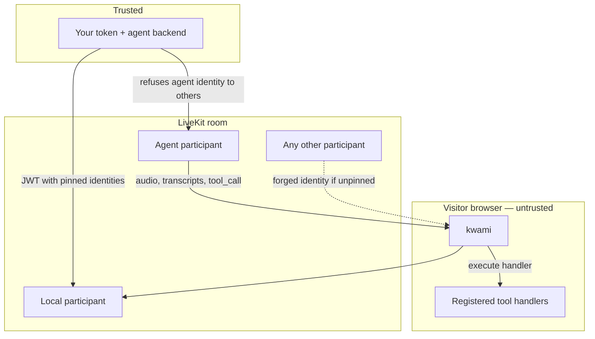

# Security

How the **library** is meant to be deployed. Reporting, supported versions, and scope are in
the root [SECURITY.md](../SECURITY.md) — **do not open a public issue for a vulnerability**.

Kwami runs in the visitor's browser. Anything you pass into `new Kwami()` or put on a LiveKit
data channel is visible to that visitor and, if the room is mis-issued, to other participants.



---

## Pin the agent identity

The adapter treats **one** remote participant as authoritative. That participant's audio is
auto-played, its transcripts become agent text, its attributes drive the UI state machine, and
its `tool_call` data messages run against tools you registered with `registerTool()`.

LiveKit participants **choose their own identity**. If you do not tell the library which one
is the agent, it falls back to a name heuristic (`agent*`, or `*kwami*` without `user`).
Another participant can satisfy that heuristic.

```ts
new Kwami(canvas, {
  agent: {
    livekit: {
      tokenEndpoint: '/api/livekit/token',
      agentIdentity: 'agent-7f3a',
      // or agentIdentityPrefix: 'kwami-agent:'
    },
  },
});
```

Rules:

1. Set `agentIdentity` (or a prefix) from the **same** service that mints the room token.
2. That service must refuse to issue the agent identity to anyone else.
3. Do not rely on the heuristic in production.

Details and the fallback order live next to the check in
[`src/agent/adapters/LiveKitAdapter.ts`](../src/agent/adapters/LiveKitAdapter.ts).

---

## Do not put provider keys in the browser

`VoicePipelineConfig` accepts `llm.apiKey`, `tts.apiKey`, `realtime.apiKey`, and
`stt.extra.apiKey` because the **backend agent** needs credentials. If you set them on the
client they ship to every visitor and can travel on the room data channel.

Hold keys on the agent host. Leave the client fields unset.

The logger ([`src/utils/logger.ts`](../src/utils/logger.ts)) masks common secret field names
so they do not hit `console`. Masking a log line is not the same as the key not being there.

---

## Tokens and the HTTP client

Kwami does not persist credentials. A LiveKit token or `authToken` lives in memory for the
session and should only be sent to the endpoint it was issued for.

[`api-client.ts`](../src/utils/api-client.ts) sends `Authorization: Bearer` when you pass
`authToken`. It never appends tokens to query strings. If you see a credential in a URL, a
log line, or a third-party host, that is in-scope — report it per [SECURITY.md](../SECURITY.md).

Instance ids (`Kwami.id`) are CSPRNG `[a-z0-9]{8}` so `getInstance` is not trivially guessable
on the same page. They are not an auth mechanism.

---

## Tool execution is host code

A `tool_call` from the **trusted** agent runs your handler in the page. Treat every handler as
an RPC surface:

- Validate arguments; do not `eval` or concatenate into HTML/SQL/shell.
- Do not register a tool that can move funds, mint, or change identity without a second
  user-visible confirmation.
- Unregister tools you no longer want the current session to have — `unregisterTool` syncs
  schemas to the backend when connected.

Skills are local and do not go through the data channel executor. They still run with the
page's privileges.

---

## WebGL and untrusted config

Renderers compile shaders and write to a canvas. Attacker-controlled strings that reach
`eval`, the DOM, or a shader compile in a way that escapes the GL sandbox are in-scope.

Passing absurd numeric config to your own instance (resolution, particle counts) is
**out of scope** as a DoS against yourself.

---

## Supply chain

Runtime dependencies that ship with the package:

| Package          | Role                    |
| ---------------- | ----------------------- |
| `livekit-client` | Room, tracks, data msgs |
| `simplex-noise`  | Avatar motion           |
| `three` (peer)   | WebGL                   |

CI runs [`scripts/ci/check-audit.mjs`](../scripts/ci/check-audit.mjs) as a **hard gate**,
ratcheted against [`scripts/ci/audit-baseline.json`](../scripts/ci/audit-baseline.json). New
critical/high advisories fail the build. The baseline only shrinks.

Publishes use [npm provenance](https://docs.npmjs.com/generating-provenance-statements). Prefer
`pnpm add kwami` from the official package; verify the provenance attestation if you pin
supply-chain policy.

DevDependency advisories that do not ship are tracked by the audit gate, not by the
vulnerability policy.

---

## Integrator checklist

- [ ] `agentIdentity` or `agentIdentityPrefix` set from the token mint
- [ ] Token endpoint will not mint the agent identity for a browser user
- [ ] No provider `apiKey` fields in client config
- [ ] Tool handlers validate input; privileged actions need a UI confirm
- [ ] `dispose()` on unmount (rooms and GL contexts leak otherwise)
- [ ] Auth tokens only on your origin's API and LiveKit URL
- [ ] You consume `kwami` from npm with a lockfile, not a random tarball

---

## Related

- [SECURITY.md](../SECURITY.md) — versions, reporting, response SLA
- [Architecture](./architecture.md) — where the adapter and tools sit
- [Getting started](./getting-started.md) — a safe minimal connect
