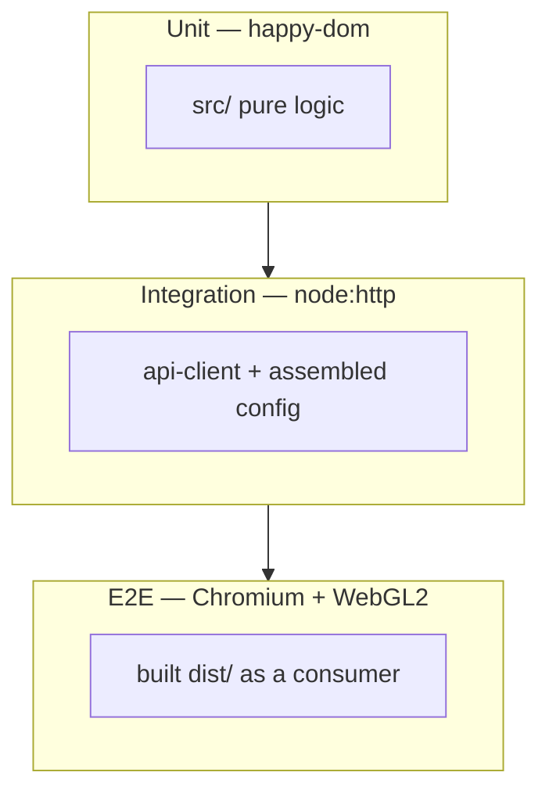

# Testing

Three layers, each answering a question the layer below it structurally cannot.



| Layer           | Runs against                                       | Environment                | Config                                                            |
| --------------- | -------------------------------------------------- | -------------------------- | ----------------------------------------------------------------- |
| **Unit**        | `src/` directly                                    | `happy-dom`                | [`vitest.config.ts`](../vitest.config.ts)                         |
| **Integration** | modules wired together + a real HTTP server        | `node`                     | [`vitest.integration.config.ts`](../vitest.integration.config.ts) |
| **E2E**         | the built `dist/`, bundled and loaded in a browser | headless Chromium + WebGL2 | [`playwright.config.ts`](../playwright.config.ts)                 |

Plus a fourth, small one: the CI scripts have their own `node --test` suite, because a bug in
the gate that judges every PR is worse than a bug in the library.

## Commands

```bash
pnpm test                 # unit, once
pnpm test:watch           # unit, watch mode
pnpm test:coverage        # unit + the coverage ratchet (what CI runs)
pnpm test:integration     # integration
pnpm test:e2e             # e2e — builds dist/ and the fixture first
pnpm test:e2e:ui          # e2e in Playwright's UI mode
pnpm test:ci-scripts      # scripts/ci/*.test.mjs under node --test
pnpm test:all             # unit → integration → e2e
```

First e2e run on a machine also needs the browser:

```bash
pnpm exec playwright install --with-deps chromium
```

## Unit — `tests/unit/`

Pure logic against `src/`, resolved by Vite, so a unit test never depends on a build. No
network, no WebGL, no waiting on timers.

What lives here: prompt shaping and trait weighting (`soul.test.ts`), the preset catalogue's
internal consistency (`soul-presets.test.ts`), tool schema normalisation and execution
(`tools.test.ts`), skill dispatch and context (`skills.test.ts`), the LiveKit Inference
descriptor format and the voice catalogue (`voice.test.ts`), randomizer ranges
(`avatar-randomizer.test.ts`), the logger's level filtering, and `randoms.ts`.

`happy-dom` supplies the DOM globals the library reaches for, at a fraction of a real browser's
cost. It does **not** supply WebGL — anything that needs a GL context belongs in the e2e layer.

### The coverage ratchet

[`vitest.config.ts`](../vitest.config.ts) sets a floor, not a target. Raise it after a clean
`pnpm test:coverage`: take the reported totals, round **down** a couple of points, commit that.
Never lower it to make a red build pass — that is the single move that turns a ratchet back into
a suggestion.

The WebGL renderers, the scene, the audio graph and the LiveKit transport are excluded from the
measurement. They are covered by the e2e layer in a real browser; counting their module bodies
as uncovered here would drag the ratio down for code unit tests cannot reach, and the honest
response to that is to exclude them, not to lower the floor.

## Integration — `tests/integration/`

Real seams, no mocks of the boundary itself.

`api-client.test.ts` boots an actual `node:http` server
([`helpers/backend.ts`](../tests/integration/helpers/backend.ts)) that speaks the Kwami backend
contract, and drives every function in `src/utils/api-client.ts` against it over a real socket.
URL construction, query-string encoding, `Authorization` headers, request bodies, `404`-as-empty
handling and `detail`-based error messages are all exercised the way they run in production. A
stubbed `fetch` would assert that the client calls the mock the way the test author imagined;
this asserts that the client and the contract agree.

`agent-config.test.ts` assembles the dispatch payload the way `Kwami.getFullConfig()` does —
Soul, ToolRegistry, SkillManager and the voice descriptor builders, four modules that never
import each other — and asserts the seams: the resolved system prompt, JSON-Schema tool
definitions with handlers stripped, skill names, wire descriptors, and that the whole thing
survives a JSON round trip, because it crosses a data channel.

It deliberately does not touch `Avatar`, which needs a WebGL context.

## E2E — `tests/e2e/`

The published bundle, in a real browser.

1. [`prepare.mjs`](../tests/e2e/prepare.mjs) builds `dist/` if it is stale, then uses Vite to
   bundle [`fixtures/app.js`](../tests/e2e/fixtures/app.js) — which imports `dist/index.js` and
   the peer dependencies — exactly the way a downstream application bundles the package.
2. [`server.mjs`](../tests/e2e/server.mjs) serves the fixture page.
3. Playwright drives headless Chromium with `--use-angle=swiftshader`, so the runner's missing
   GPU still yields a real WebGL2 context in software rather than no context at all.

`library.spec.ts` asserts the bundle loads without throwing, that the named exports survived the
build, that a `Kwami` mounts on a canvas and the renderer **actually draws** (it reads the
drawing buffer back and counts non-background pixels rather than trusting that construction
succeeded), that state transitions and live reconfiguration work, and that `dispose()`
unregisters the instance.

This is the only layer that catches a broken `exports` map, a shader that fails to compile, a
`?raw` import the build inlined wrongly, or a renderer that mounts but never produces a frame —
all of which typecheck cleanly and pass in `happy-dom`.

In CI the job downloads the `dist` artifact the `build` job produced rather than rebuilding, so
the bytes under test are the bytes that would be published.

## CI scripts — `scripts/ci/*.test.mjs`

[`assert-promotion-path.test.mjs`](../scripts/ci/assert-promotion-path.test.mjs) covers the
branch-promotion rules as pure functions: feature branches into `dev`, forks, stale heads,
namesake fork branches, skipped channels, back-merge attempts and malformed input. The gate that
judges every PR is itself gated.

## Adding a test

**Pick the layer by what would break it.**

- Would a wrong pure-function result break it? → unit.
- Would a URL, header, status code or module-to-module contract break it? → integration.
- Would only a real browser, a real GL context or the shape of the built package break it? → e2e.

**Conventions.**

- One behaviour per `it`, named as the behaviour, not the method: `'treats a 404 as an empty
graph, not an error'`, not `'test getMemoryGraph'`.
- Assert on the observable result, not on internal calls, unless the call _is_ the contract
  (a `PATCH` where a `PUT` would be wrong).
- When a test exists because of a specific past failure, say so in a comment — future readers
  need to know what it is defending, or they will delete it during a cleanup.
- No `.only` in a committed file; `forbidOnly` fails the e2e run in CI if one slips through.

**Before you push:**

```bash
pnpm lint && pnpm typecheck && pnpm test:unit && pnpm test:integration
```

`.husky/pre-push` runs the typecheck and the unit suite for you. The integration and e2e layers
are left to CI unless you touched the api-client, the build, or a renderer.
